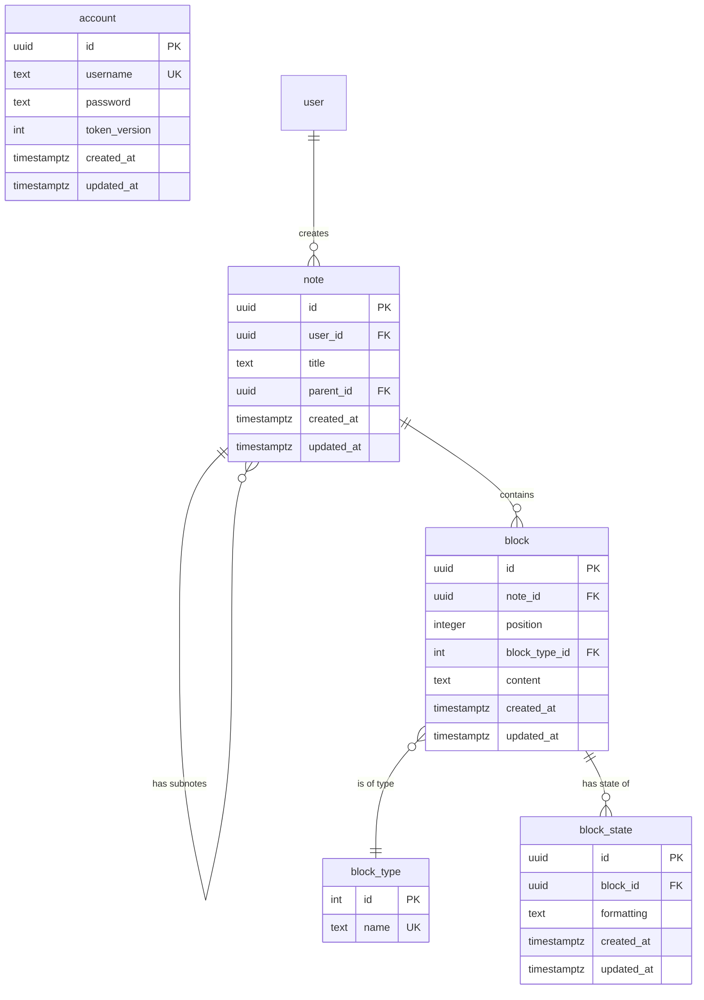

```mermaid
erDiagram
    account {
        uuid id PK
        text username UK
        text password
        int token_version
        timestamptz created_at
        timestamptz updated_at
    }
    
    note {
        uuid id PK
        uuid user_id FK
        text title
        uuid parent_id FK
        timestamptz created_at
        timestamptz updated_at
    }
    
    block {
        uuid id PK
        uuid note_id FK
        integer position
        int block_type_id FK
        text content
        timestamptz created_at
        timestamptz updated_at
    }

    block_type {
        int id PK
        text name UK
    }

    block_state {
        uuid id PK
        uuid block_id FK
        text formatting
        timestamptz created_at
        timestamptz updated_at
    }

    user ||--o{ note : "creates"
    note ||--o{ note : "has subnotes"
    note ||--o{ block : "contains"
    block }o--|| block_type : "is of type"
    block ||--o{ block_state : "has state of"
```
