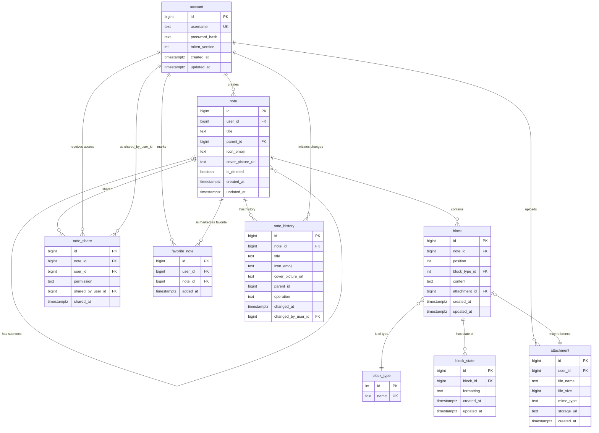

```mermaid
erDiagram
    account {
        bigint id PK
        text username UK
        text password_hash
        int token_version
        timestamptz created_at
        timestamptz updated_at
    }
    
    note {
        bigint id PK
        bigint user_id FK
        text title
        bigint parent_id FK
        text icon_emoji
        text cover_picture_url
        boolean is_deleted
        timestamptz created_at
        timestamptz updated_at
    }
    
    block {
        bigint id PK
        bigint note_id FK
        int position
        int block_type_id FK
        text content
        bigint attachment_id FK
        timestamptz created_at
        timestamptz updated_at
    }

    block_type {
        int id PK
        text name UK
    }

    block_state {
        bigint id PK
        bigint block_id FK
        text formatting
        timestamptz created_at
        timestamptz updated_at
    }

    attachment {
        bigint id PK
        bigint user_id FK
        text file_name
        bigint file_size
        text mime_type
        text storage_url
        timestamptz created_at
    }

    note_share {
        bigint id PK
        bigint note_id FK
        bigint user_id FK
        text permission
        bigint shared_by_user_id FK
        timestamptz shared_at
    }

    favorite_note {
        bigint id PK
        bigint user_id FK
        bigint note_id FK
        timestamptz added_at
    }

    note_history {
        bigint id PK
        bigint note_id FK
        text title
        text icon_emoji
        text cover_picture_url
        bigint parent_id
        text operation
        timestamptz changed_at
        bigint changed_by_user_id FK
    }

    account ||--o{ note : "creates"
    note |o--o{ note : "has subnotes"
    account ||--o{ attachment : "uploads"

    note ||--o{ note_share : "shared"
    account ||--o{ note_share : "receives access"
    account ||--o{ note_share : "as shared_by_user_id"

    note ||--o{ note_history : "has history"
    account ||--o{ note_history : "initiates changes"

    account ||--o{ favorite_note : "marks"
    note ||--o{ favorite_note : "is marked as favorite"

    note ||--o{ block : "contains"
    block }o--|| block_type : "is of type"
    block ||--o{ block_state : "has state of"
    block |o--|| attachment : "may reference"
```
